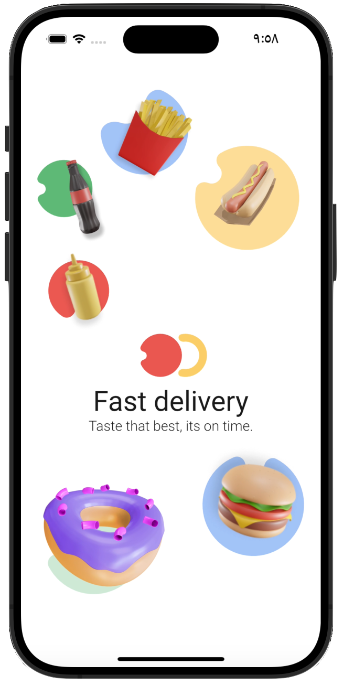
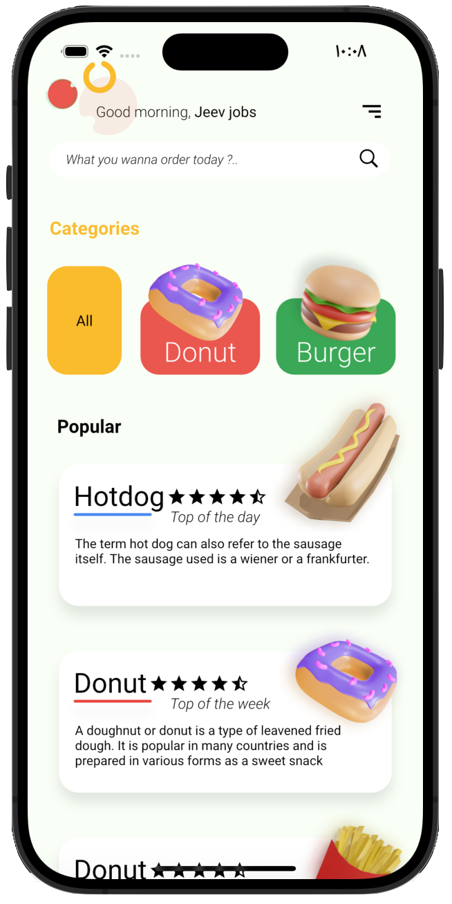
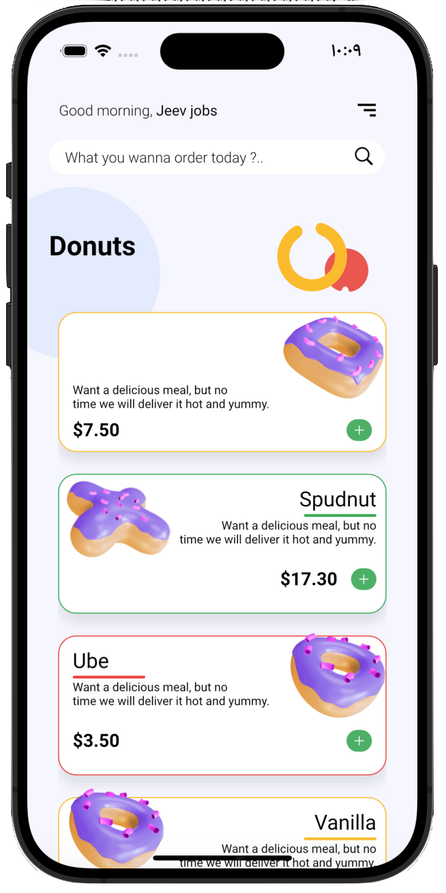
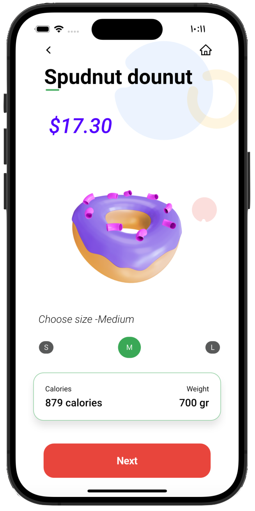
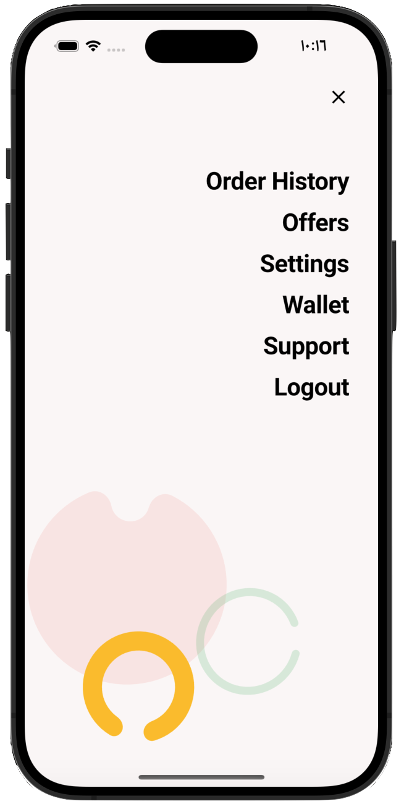
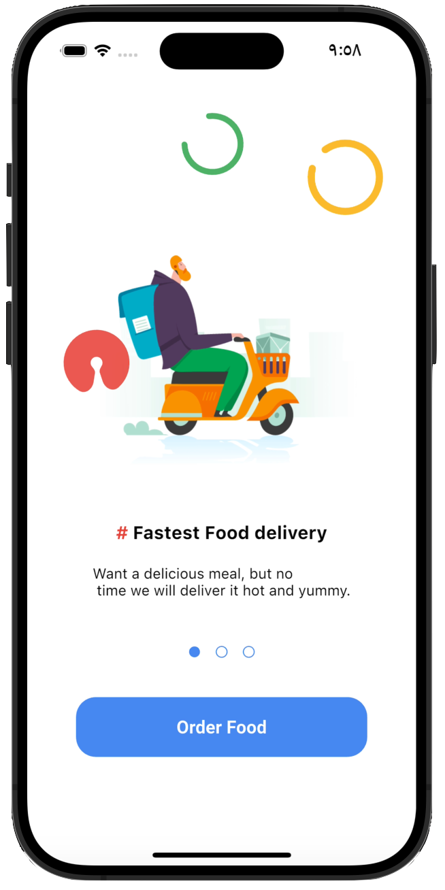
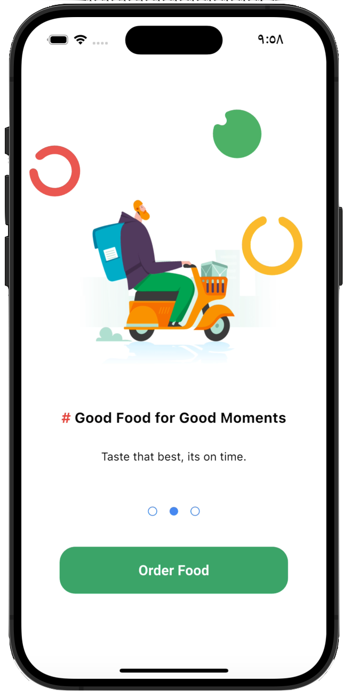
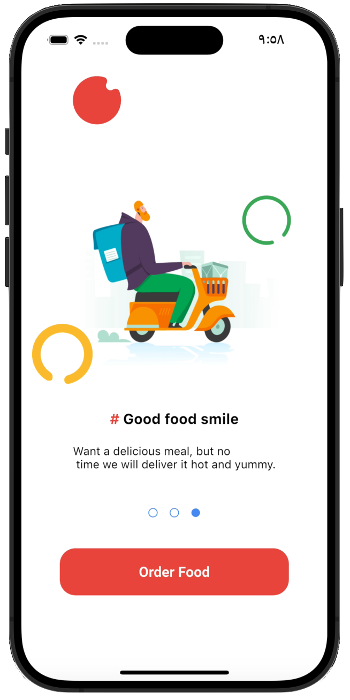

# Food Delivery App

A modern, visually appealing, and fully functional food delivery application built with Flutter. This app demonstrates clean architecture, beautiful UI, and smooth animations for a delightful user experience.

## Features

- Onboarding screens with custom animations
- Home screen with categories and popular items
- Product details with hero animations and size selection
- Adaptive widgets for different platforms
- Custom painters and animated transitions
- Splash screen and onboarding flow

## Screenshots

| Onboarding | Home | Details | About | Tab Bar Action |
|------------|------|---------|-------|----------------|
|  |  |  |  |  |

### Additional Onboarding Screens

| Onboarding 1 | Onboarding 2 | Onboarding 4 |
|--------------|--------------|--------------|
|  |  |  |

## Getting Started

### Prerequisites
- [Flutter](https://flutter.dev/docs/get-started/install) (latest stable)
- Dart SDK

### Installation

1. Clone the repository:
   ```bash
   git clone https://github.com/najeebaslan/food_delivery.git
   cd food_delivery
   ```
2. Install dependencies:
   ```bash
   flutter pub get
   ```
3. Run the app:
   ```bash
   flutter run
   ```

## Folder Structure

```
lib/
  core/           # Core utilities, constants, styles, widgets
  features/       # Feature modules (home, menu, onboarding, product details, splash)
  main.dart       # App entry point
assets/
  fonts/          # Custom fonts
  images/         # App images and icons
```

## Dependencies
- [Flutter](https://flutter.dev/)
- [Dart](https://dart.dev/)
- (Add any other major dependencies here)

## Contributing

Contributions are welcome! Please open issues and submit pull requests for improvements or bug fixes.

1. Fork the repository
2. Create your feature branch (`git checkout -b feature/YourFeature`)
3. Commit your changes (`git commit -am 'Add new feature'`)
4. Push to the branch (`git push origin feature/YourFeature`)
5. Open a pull request

## License

This project is licensed under the MIT License - see the [LICENSE](LICENSE) file for details.